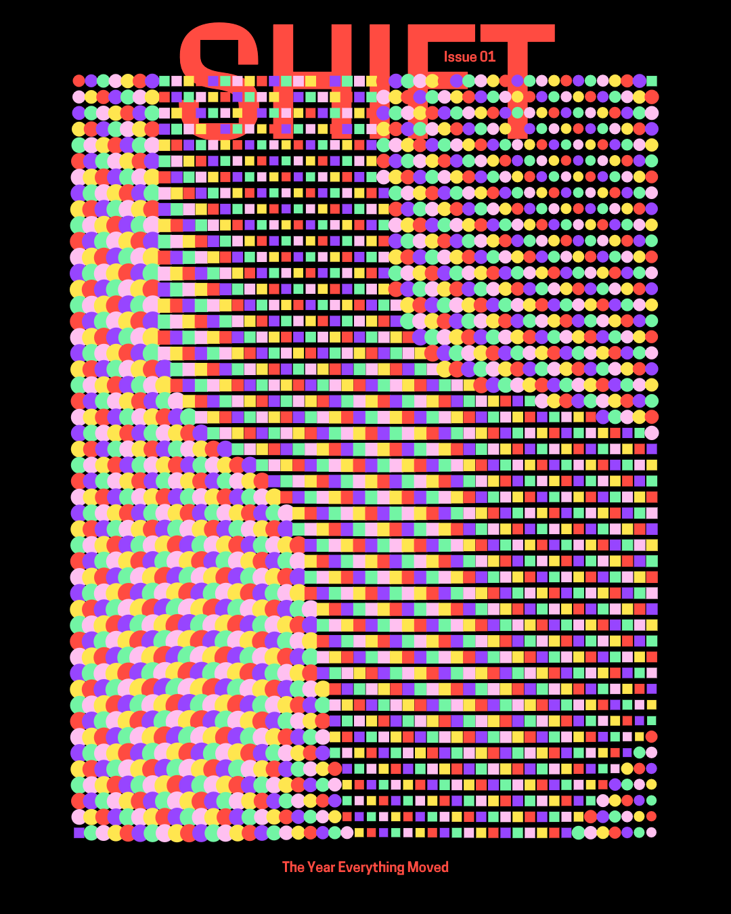

# Creative Coding by Ruslan Mashkov

Generative posters, animations, and code experiments — exploring shapes, color, and motion.  
Built with [canvas-sketch](https://github.com/mattdesl/canvas-sketch), p5.js, WebGL, and other tools.

🔗 **Live gallery:** https://marjanblan.github.io/creative-coding

---

## About this repository
This is my personal archive of creative coding works.  
Each sketch lives in its own folder inside `/sketches`, with:
- `sketch.js` — the source code
- `meta.json` — metadata (title, date, tools, tags, description)
- `preview.png` or `preview.gif` — a visual preview
- `export/` — optional rendered frames or videos

The repository also includes:
- `/site` — GitHub Pages static gallery
- `/scripts` — automation tools (e.g., gallery generator)

---

## Gallery
<!-- GALLERY:START -->
| Preview | Title | Date |
|---|---|---|
|  | [Looping Grid](https://github.com/marjanblan/creative-coding/tree/main/sketches/2025-08-09_looping-grid) | 2025-08-09 |
<!-- GALLERY:END -->

---

## How to view sketches locally
Most sketches are made with [canvas-sketch](https://github.com/mattdesl/canvas-sketch) or p5.js.  
To run locally:

```bash
# Clone the repository
git clone https://github.com/marjanblan/creative-coding.git
cd creative-coding

# Install dependencies
npm install

# Run a local web server (for the gallery)
npm run dev
